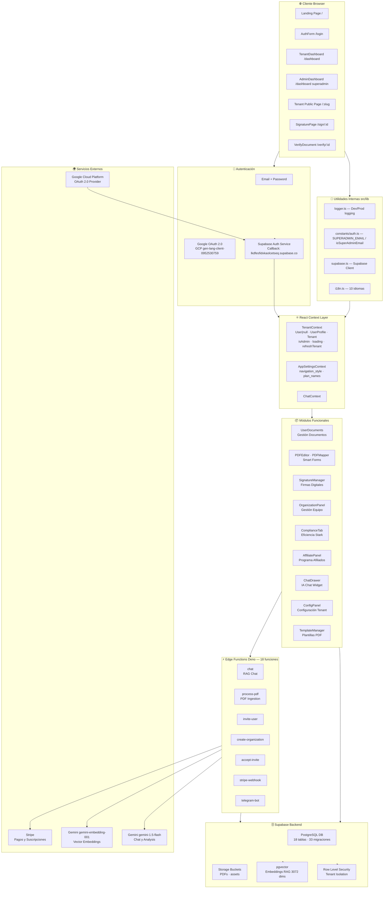
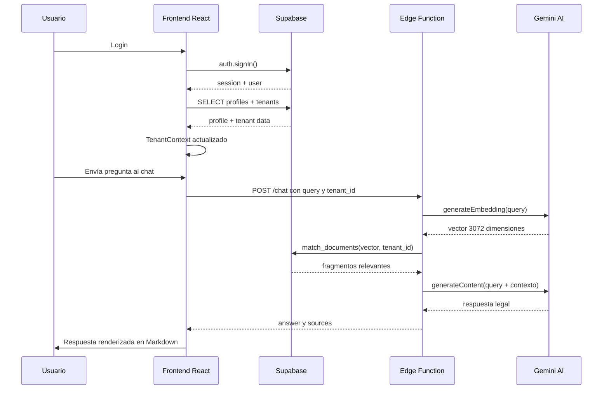

# 📋 PROJECT STATUS — Legal AI Global
> **Versión del documento:** 1.6  
> **Fecha de creación:** Septiembre 2026  
> **Última actualización:** 25 septiembre 2026 — 💬 Persistencia de Historial de Chat IA en Supabase activa  
> **Autor:** Antigravity (IA Arquitecto Senior)  
> **Propósito:** Documento de referencia técnica y funcional para mantenimiento, mejoras futuras y onboarding de nuevos desarrolladores.

---

## 📌 ÍNDICE
1. [Resumen Ejecutivo](#1-resumen-ejecutivo)
2. [Stack Tecnológico](#2-stack-tecnológico)
3. [System Map — Diagrama de Arquitectura](#3-system-map--diagrama-de-arquitectura)
4. [Módulos Funcionales](#4-módulos-funcionales)
5. [Rutas y Navegación](#5-rutas-y-navegación)
6. [Base de Datos Supabase](#6-base-de-datos-supabase)
7. [Edge Functions Backend Serverless](#7-edge-functions-backend-serverless)
8. [Sistema de IA y RAG Pipeline](#8-sistema-de-ia-y-rag-pipeline)
9. [Internacionalización i18n](#9-internacionalización-i18n)
10. [Sistema de Planes y Suscripciones](#10-sistema-de-planes-y-suscripciones)
11. [Estado Actual por Módulo](#11-estado-actual-por-módulo)
12. [Deuda Técnica y Archivos Críticos](#12-deuda-técnica-y-archivos-críticos)
13. [Guía de Mantenimiento](#13-guía-de-mantenimiento)
14. [Roadmap de Mejoras Sugeridas](#14-roadmap-de-mejoras-sugeridas)
15. [Plan de Verificación Técnica](#15-plan-de-verificación-técnica-del-proyecto)
16. [Historial de Cambios](#16-historial-de-cambios)

---

## 1. Resumen Ejecutivo

**Legal AI Global** es una plataforma SaaS B2B multi-tenant orientada a la **asistencia legal con inteligencia artificial**, diseñada principalmente para comunidades inmigrantes. Permite a organizaciones (ONGs, bufetes, clínicas jurídicas) ofrecer a sus usuarios acceso a:

- Consultas legales vía chat con IA (RAG sobre base de conocimiento propia)
- Gestión y firma digital de documentos legales
- Plantillas PDF inteligentes con mapeo de campos
- Cumplimiento normativo y compliance de documentos
- Panel de administración multi-tenant completo

La plataforma soporta **10 idiomas** (ES, EN, AR, FR, PT, RU, UR, ZH, WO, BM) y está construida sobre una arquitectura **React + Vite + Supabase + Gemini AI**.

### Métricas del proyecto

| Métrica | Valor |
|---|---|
| Total componentes React | ~65 componentes |
| Total Edge Functions | 18 funciones serverless |
| Total migraciones SQL | 33 migraciones |
| Idiomas soportados | 10 |
| Archivos de código fuente | ~86 archivos `.tsx/.ts` |
| Regla de límite de archivos | Máx. 300 líneas por archivo |
| Último build de producción | ✅ 25 sep 2026 — 4074 módulos, 37s |

---

## 2. Stack Tecnológico

### Frontend

| Tecnología | Versión | Uso |
|---|---|---|
| **React** | 18.2 | Framework UI principal |
| **TypeScript** | 5.2 | Tipado estático |
| **Vite** | 5.1 | Bundler y dev server |
| **React Router DOM** | 7.14 | Enrutado SPA |
| **Tailwind CSS** | 3.4 | Estilos utilitarios |
| **Framer Motion** | 11.18 | Animaciones |
| **i18next** | 25.8 | Internacionalización |
| **Recharts** | 3.7 | Gráficas y estadísticas |
| **react-pdf** | 10.3 | Visualización de PDFs |
| **pdf-lib** | 1.17 | Generación/modificación de PDFs |
| **react-signature-canvas** | 1.1 | Captura de firmas digitales |
| **lucide-react** | 0.344 | Sistema de iconos |

### Utilidades Internas

| Archivo | Líneas | Propósito |
|---|---|---|
| `src/lib/logger.ts` | 38 | Logger condicional: silencia `log/warn/info` en producción, siempre activo `error` |
| `src/lib/supabase.ts` | ~20 | Cliente Supabase inicializado con env vars |
| `src/lib/i18n.ts` | ~40 | Configuración i18next con los 10 idiomas |
| `src/lib/TenantContext.tsx` | 192 | Context global de auth, perfil y tenant (tipos Supabase estrictos) |

### Backend / Infraestructura

| Tecnología | Uso |
|---|---|
| **Supabase** | BaaS: PostgreSQL, Auth, Storage, Edge Functions |
| **Supabase Auth** | Autenticación email/password + **Google OAuth 2.0** |
| **Google Cloud GCP** | Proyecto `Legal Assistant` (`gen-lang-client-0952530759`) para OAuth |
| **Supabase Storage** | Almacenamiento de PDFs y activos |
| **PostgreSQL + pgvector** | Base de datos + embeddings vectoriales para RAG |
| **Deno** | Runtime de Edge Functions |
| **Google Gemini AI** | LLM para chat y embeddings (gemini-1.5-flash, gemini-embedding-001) |
| **Stripe** | Pagos y gestión de suscripciones (webhook integrado) |

---

## 3. System Map — Diagrama de Arquitectura

> [!NOTE]
> Actualizado el 25 sep 2026 — Se añade Google OAuth 2.0, capa de utilidades internas (logger.ts) y flujo de autenticación completo.



### Flujo Principal de Datos — Chat RAG



---

## 4. Módulos Funcionales

### 4.1 Landing Page /

**Archivos:** `src/components/LandingPage.tsx`, `Hero.tsx`, `BentoGrid.tsx`, `PricingPlans.tsx`

Página pública de entrada al producto. Muestra:
- Hero animado con propuesta de valor
- Bento grid de características del producto
- Sección de precios con los tres planes (Starter, Business, Enterprise)
- Botones de acción: Login y Crear Organización
- Footer dinámico con traducciones automáticas

### 4.2 Autenticación /login y /create-org

**Archivos:** `src/components/AuthForm.tsx`, `CreateOrgForm.tsx`

- **Login/Registro:** Email + contraseña y **Google OAuth 2.0** via Supabase Auth
- **Configuración Google OAuth:**
  - Proyecto GCP: `Legal Assistant` (`gen-lang-client-0952530759`)
  - Correo de asistencia: `info@thelusacia.com`
  - Callback URI: `https://lkdfesfidxkaolcetseq.supabase.co/auth/v1/callback`
- **Registro de organización:** Formulario multi-paso que invoca la Edge Function `create-organization`
- **Splash Screen:** Animación de bienvenida post-login (`SplashScreen.tsx`)
- **Join Page** (`/join`): Unirse a una organización via token de invitación

### 4.3 Dashboard de Tenant /dashboard

**Archivo:** `src/components/TenantDashboard.tsx`

Panel principal para usuarios de organizaciones. Pestañas disponibles:

| Pestaña | ID | Acceso | Descripción |
|---|---|---|---|
| Mi Dashboard | home | Todos | Vista resumen con métricas del usuario |
| Documentos | documents | Todos | Gestión de documentos personales |
| Plantillas | templates | Admin | Gestor de plantillas PDF |
| Eficiencia Stark | compliance | Admin | Sistema de compliance de documentos |
| Organización | organization | Admin | Gestión de miembros e invitaciones |
| Afiliados | affiliates | Todos | Panel del programa de afiliados |
| Configuración | settings | Admin | Configuración del tenant |

**Modos de navegación configurables:**
- **Sidebar** lateral: Activable via `settings.navigation_style = 'sidebar'`
- **Top Tabs** pestañas superiores: Modo por defecto

### 4.4 Admin Dashboard /dashboard para superadmin

**Archivo:** `src/components/AdminDashboard.tsx`

Panel exclusivo del superadmin. Acceso por email hardcoded `lsergiom76@gmail.com` o `role = superadmin`.

| Pestaña | Descripción |
|---|---|
| MI DASHBOARD | KPIs de negocio, gráficas de ingresos |
| MIS DOCUMENTOS | Gestión de documentos personales |
| PLANTILLAS | Gestor de plantillas PDF |
| LEYES GLOBALES | Gestión de PDFs legales globales para RAG |
| COMPLIANCE GLOBAL | Módulo Eficiencia Stark a nivel global |
| MI ORGANIZACIÓN | Panel de organización del admin |
| ORGANIZACIONES | Listado de todos los tenants + gestión de planes |
| AFILIADOS | Panel de afiliados completo |
| CONFIGURACIÓN | Configuración global del sistema |

### 4.5 Gestión de Documentos UserDocuments

**Archivo:** `src/components/UserDocuments.tsx`

- Listado de documentos del usuario con filtros
- Subida de PDFs con validación de límites por plan
- Procesamiento de PDFs para RAG via Edge Function `process-pdf`
- Descarga y eliminación de documentos
- **Soft delete** implementado (no se borran físicamente de storage)

### 4.6 PDF Mapper y Editor Smart Forms

**Directorio:** `src/components/PDFMapper/`

Sistema de mapeo de campos en PDFs. Compuesto por:

| Archivo | Función |
|---|---|
| `PDFEditor.tsx` | Editor principal con visor de PDF interactivo |
| `PDFEditorHeader.tsx` | Barra de herramientas superior del editor |
| `PDFUploader.tsx` | Subida de PDF base para mapear |
| `MappingInspector.tsx` | Panel de inspección y configuración de campos |
| `SignatureManager.tsx` | Gestión de campos de firma dentro del PDF |
| `TemplateSelectorModal.tsx` | Modal para seleccionar plantillas existentes |
| `constants.ts` | Definición de tipos de campo disponibles |
| `types.ts` | TypeScript types del módulo |

**Capacidades:**
- Drag and drop de campos sobre el PDF renderizado
- Tipos de campo: Texto, Firma, Fecha, Checkbox, QR
- Guardado de mapeos en tabla `form_fields_mapping`
- Generación de PDF relleno con los datos ingresados

### 4.7 Firmas Digitales

**Archivos:** `src/components/Signature/`, `SignaturePage.tsx`, `SignatureRequestModal.tsx`

Sistema completo de firma electrónica:

| Componente | Función |
|---|---|
| `SignaturePage.tsx` | Página pública donde el firmante firma el documento /sign/:id |
| `SignatureLayout.tsx` | Layout base de la página de firma |
| `DocumentViewer.tsx` | Visor del PDF a firmar |
| `SignaturePad.tsx` | Canvas interactivo para dibujar la firma |
| `SignatureCanvas.tsx` | Canvas reutilizable de captura |
| `SignDocumentModal.tsx` | Modal de confirmación y envío |
| `SignatureStates.tsx` | Estados visuales: loading, firmado, expirado, error |
| `AuditTrail.tsx` | Trazabilidad completa de firmas |
| `SignatureRequestModal.tsx` | Modal para crear y enviar solicitudes de firma |

**Flujo completo de firma:**
1. Admin crea solicitud de firma en `SignatureRequestModal`
2. Supabase almacena en `document_signature_requests`
3. Se genera URL pública `/sign/:id` con token único
4. El firmante accede, visualiza el PDF y dibuja su firma
5. La firma se guarda en Storage y se registra en `document_signature_logs`
6. Se genera PDF firmado con evidencia y timestamp

### 4.8 Panel de Organización

**Archivo:** `src/components/OrganizationPanel.tsx`

Gestión del equipo de la organización. Sub-vistas:
- **Members:** Listado de miembros activos con roles
- **Invite:** Formulario para invitar nuevos usuarios (llama a `invite-user`)
- **Signatures:** Gestión de solicitudes de firma del equipo

### 4.9 Chat IA ChatDrawer

**Archivos:** `src/components/ChatDrawer.tsx`, `src/hooks/useChatLogic.ts`

Widget de chat flotante disponible para todos los usuarios autenticados:
- Respuestas renderizadas en Markdown via `react-markdown`
- Contexto del tenant para búsqueda RAG aislada por organización
- Historial de conversación en sesión (no persistido en DB — deuda técnica)
- Límite de consultas validado por plan en Edge Function
- Soporte multilingüe completo

### 4.10 Compliance Eficiencia Stark

**Archivo:** `src/components/Admin/ComplianceTab.tsx`

Sistema de compliance de documentos de la organización:
- Listado de documentos de cumplimiento requeridos
- Estado por documento (pendiente, firmado, vencido)
- Integración con el sistema de firmas digitales
- Vista de auditoría por documento

### 4.11 Programa de Afiliados

**Archivos:** `src/components/AffiliatePanel.tsx`, `RegisterAffiliate.tsx`, `AffiliateKit.tsx`, `AffiliateTerms.tsx`

- Registro de afiliados con datos fiscales y bancarios
- Dashboard de comisiones y referidos
- Kit de marketing descargable
- Integración con Stripe para pagos de comisiones
- Términos y condiciones del programa

### 4.12 Plantillas PDF TemplateManager

**Archivo:** `src/components/TemplateManager.tsx`

- CRUD de plantillas PDF en tabla `pdf_templates`
- Soporte de bundles (agrupaciones de plantillas) via `pdf_bundles`
- Asociación con campos mapeados del PDFMapper
- Gestión de versiones de plantillas

### 4.13 Configuración del Tenant ConfigPanel

**Archivo:** `src/components/ConfigPanel.tsx`

Panel de configuración completo para admins:
- Datos de la organización (nombre, logo, slug vanity)
- Configuración del pie de página personalizable
- Configuración de la IA (modelo, tono, idioma preferido)
- Estilo de navegación (sidebar vs. top tabs)
- Límites y preferencias del plan activo

### 4.14 Página Pública del Tenant /:slug

**Archivo:** `src/components/TenantPublicPage.tsx`

Landing page pública y personalizable por cada organización:
- URL vanity tipo `dominio.com/{slug-de-la-org}`
- Muestra el branding del tenant
- Botón de acceso para usuarios de la organización
- Accesible sin autenticación

### 4.15 Verificación de Documentos /verify/:id

**Archivo:** `src/components/VerifyDocument.tsx`

Página pública para verificar la autenticidad de un documento firmado:
- Valida el hash del documento contra la base de datos
- Muestra el audit trail completo con timestamps e IPs
- Accesible sin login para cualquier parte interesada

---

## 5. Rutas y Navegación

```
/                       Landing Page pública
/login                  Formulario de autenticación
/create-org             Registro de nueva organización
/dashboard              Dashboard principal Tenant o Admin
/dashboard/:tab         Dashboard con pestaña específica por URL
/documents              Alias a dashboard/documents
/legal-procedures       Guía de procedimientos legales pública
/halal-culture          Guía de cultura Halal pública
/housing-guide          Guía de vivienda pública
/privacy                Política de privacidad
/cookies                Política de cookies
/join                   Unirse a organización por token
/sign/:id               Firma pública de documento
/verify/:id             Verificación pública de documento
/afiliados-terminos     Términos del programa de afiliados
/register-affiliate     Registro de afiliado
/affiliate-kit          Kit de marketing para afiliados
/:slug                  Página pública del tenant vanity URL
```

**Palabras reservadas** que no se interpretan como slugs de tenant:
`public`, `dashboard`, `documents`, `login`, `create-org`, `privacy`, `cookies`, `sign`, `verify`, `join`, `enterprise`

---

## 6. Base de Datos Supabase

### Tablas Principales

| Tabla | Propósito |
|---|---|
| `profiles` | Perfiles de usuario con role, tenant_id, subscription_tier |
| `tenants` | Organizaciones multi-tenant con nombre, slug, plan, config |
| `tenant_invitations` | Tokens de invitación para unirse a un tenant |
| `subscriptions` | Suscripciones activas por usuario free/pro/business |
| `usage_tracking` | Contadores de uso mensual por usuario |
| `documents` | Documentos subidos con tenant isolation |
| `knowledge_base` | Fragmentos de texto y embeddings vectoriales para RAG |
| `pdf_templates` | Plantillas PDF guardadas |
| `form_fields_mapping` | Campos mapeados en cada plantilla PDF |
| `pdf_bundles` | Agrupaciones de plantillas |
| `bundle_templates` | Relación bundle a template |
| `document_signature_requests` | Solicitudes de firma creadas |
| `document_signature_logs` | Registro de firmas completadas con audit trail |
| `organization_settings` | Configuración personalizada por organización |
| `affiliates` | Datos de afiliados registrados |
| `affiliate_referrals` | Referidos rastreados por afiliado |
| `affiliate_commissions` | Comisiones calculadas y pagadas |
| `global_settings` | Configuración global de la plataforma |

### Seguridad Row Level Security RLS

Todas las tablas tienen RLS activado:
- **Tenant Isolation:** Un usuario solo ve datos de su propio tenant
- **Superadmin bypass:** `role = 'superadmin'` accede a todos los datos
- **Public access:** Algunas tablas permiten acceso público con token válido (firmas, verificación)

### Funciones PostgreSQL Clave

| Función RPC | Propósito |
|---|---|
| `can_perform_action(user_id, action_type)` | Valida si el usuario puede actuar según su plan |
| `increment_usage(user_id, action_type)` | Incrementa contadores de uso |
| `get_tier_limits(tier)` | Devuelve los límites de un plan |
| `match_documents(embedding, tenant_id, threshold)` | Búsqueda vectorial para RAG |
| `get_public_audit_trail(document_id)` | Audit trail público de un documento firmado |

---

## 7. Edge Functions Backend Serverless

Todas las funciones están en `supabase/functions/` y corren sobre Deno.

| Función | JWT | Propósito |
|---|---|---|
| `chat` | No | Motor RAG: embedding, búsqueda vectorial, respuesta con Gemini |
| `process-pdf` | No | Extrae texto de PDF, genera embeddings, almacena en knowledge_base |
| `create-organization` | No | Crea tenant nuevo con configuración inicial y perfil admin |
| `invite-user` | No | Envía email de invitación con token único para unirse a tenant |
| `accept-invite` | Sí | Valida token de invitación y asocia usuario al tenant |
| `delete-document` | No | Elimina documento con soft delete y limpieza de storage |
| `analyze-contract` | — | Análisis de contratos con IA Gemini |
| `analyze-compliance` | — | Análisis de cumplimiento normativo con IA |
| `stripe-webhook` | — | Recibe eventos de Stripe para actualizar suscripciones |
| `telegram-bot` | — | Bot de Telegram integrado |
| `translate-footer` | — | Traduce el pie de página usando IA |
| `seed-global` | — | Carga documentos legales globales en base de conocimiento |
| `ingest` | — | Ingesta manual de documentos al RAG |
| `automated-pdf-ingestor` | — | Ingesta automatizada de PDFs |
| `halal-checker` | — | Verificador de conformidad Halal |
| `debug-models` | — | Utilidad de debug de modelos AI |
| `list-models` | — | Lista modelos AI disponibles |

---

## 8. Sistema de IA y RAG Pipeline

### Arquitectura RAG Retrieval-Augmented Generation

```
PDF Subido
    |
process-pdf Edge Function
    |
Extracción de texto con unpdf / pdfjs-dist
    |
Chunking fragmentos de ~500 tokens
    |
Gemini Embedding API gemini-embedding-001 -> vector 3072 dimensiones
    |
INSERT en knowledge_base texto + embedding + metadata tenant_id

--- Cuando el usuario pregunta ---

Query del usuario
    |
chat Edge Function
    |
Gemini Embedding -> vector 3072 del query
    |
match_documents() en PostgreSQL pgvector cosine similarity
    |
Top K fragmentos más relevantes recuperados
    |
Gemini generateContent gemini-1.5-flash + contexto + query
    |
Respuesta legal en el idioma del usuario
```

### Modelos Utilizados

| Modelo | Uso | API Version |
|---|---|---|
| `gemini-1.5-flash` | Chat, análisis de contratos, compliance | v1 |
| `gemini-embedding-001` | Generación de embeddings vectoriales | v1 |

### Configuración de Embeddings

- **Dimensiones del vector:** 3072 (columna `embedding vector(3072)` en PostgreSQL)
- **Similitud:** Cosine similarity via pgvector extension
- **Threshold mínimo:** Configurable, típicamente 0.75

---

## 9. Internacionalización i18n

**Librería:** i18next + react-i18next + i18next-browser-languagedetector  
**Configuración:** `src/lib/i18n.ts`  
**Detección:** Automática por navegador, con fallback a español

### Idiomas soportados

| Código | Idioma | Tamaño aprox. |
|---|---|---|
| es | Español | 1.170 líneas |
| en | Inglés | 1.113 líneas |
| ar | Árabe | 1.143 líneas |
| fr | Francés | 1.171 líneas |
| pt | Portugués | 1.191 líneas |
| ru | Ruso | 1.219 líneas |
| ur | Urdu | 699 líneas |
| wo | Wolof | 701 líneas |
| zh | Chino | ~600 líneas |
| bm | Bambara | ~400 líneas |

> [!WARNING]
> Los idiomas WO (Wolof) y BM (Bambara) tienen cobertura inferior al 60%. Secciones del dashboard pueden aparecer en español como fallback.

---

## 10. Sistema de Planes y Suscripciones

### Planes disponibles

| UI visible al usuario | DB interno | Tipo |
|---|---|---|
| **Starter** | `free` | Gratuito |
| **Business** | `pro` | Pago mensual |
| **Enterprise** | `business` | Pago mensual/anual |

### Límites por plan

| Límite | Starter | Business | Enterprise |
|---|---|---|---|
| Chat queries/mes | 5 | 100 | Ilimitado |
| Documentos máximos | 1 | 20 | Ilimitado |
| Acceso API | No | No | Sí |
| Soporte prioritario | No | Sí | Sí |

### Mecanismo de validación

La validación ocurre **en base de datos** via `can_perform_action()`:

1. Consulta `subscriptions` para el tier activo del usuario
2. Consulta `usage_tracking` para el uso del período actual
3. Compara contra `get_tier_limits(tier)`
4. Si aprobado → llama a `increment_usage()`
5. Si rechazado → frontend muestra `UpgradeModal`

> [!NOTE]
> Los nombres de los planes son configurables via `settings.plan_names` desde la configuración global sin requerir redeploy de código.

---

## 11. Estado Actual por Módulo

| Módulo | Estado | Notas |
|---|---|---|
| Landing Page | ✅ Funcional | Completa con precios, hero, bento grid |
| Autenticación | ✅ Funcional | Login, registro, splash screen |
| Tenant Dashboard | ✅ Funcional | Sidebar y top tabs operativos |
| Admin Dashboard | ✅ Funcional | Todas las pestañas operativas |
| Gestión Documentos | ✅ Funcional | Upload, list, soft-delete, RAG activo |
| PDF Mapper Editor | ✅ Funcional | Refactorizado en 5 módulos |
| Firmas Digitales | ✅ Funcional | Flujo completo end-to-end |
| Chat IA RAG | ✅ Funcional | gemini-embedding-001 v1 estable |
| Compliance Stark | ✅ Funcional | Lista de docs y estados activos |
| Organización | ✅ Funcional | Miembros, invitaciones, firmas |
| Programa Afiliados | ⚠️ Parcial | UI completa, Stripe pendiente de pruebas |
| Plantillas PDF | ✅ Funcional | CRUD operativo |
| Config del Tenant | ✅ Funcional | Todas las secciones operativas |
| Página Pública Tenant | ✅ Funcional | Vanity URLs funcionando |
| Verificación Docs | ✅ Funcional | Audit trail público activo |
| i18n 10 idiomas | ⚠️ Parcial | WO y BM con cobertura menor al 60% |
| Sistema de Pagos Stripe | ⚠️ Parcial | Webhook implementado, checkout sin validar |
| Telegram Bot | ⚠️ Sin documentar | Edge Function existe sin UI de configuración |

---

## 12. Deuda Técnica y Archivos Críticos

### Estado de Refactorizaciones (Regla < 300 líneas)

> 🎯 **100% COMPLETADO:** Cero archivos en `/src` superan las 300 líneas de código.

| Archivo | Líneas actuales | Líneas anteriores | Estado |
|---|---|---|---|
| `src/components/AdminDashboard.tsx` | **234** | 303 | ✅ Resuelto (v1.5) |
| `src/components/OrganizationPanel.tsx` | **237** | 314 | ✅ Resuelto (v1.5) |
| `src/components/PDFMapper/PDFEditor.tsx` | **265** | 334 | ✅ Resuelto (v1.5) |
| `src/components/Organization/MemberDirectory.tsx` | **248** | 369 | ✅ Resuelto (v1.5) |
| `src/components/SignaturePage.tsx` | **146** | 372 | ✅ Resuelto (v1.4) |
| `src/components/ChatDrawer.tsx` | **103** | 324 | ✅ Resuelto (v1.4) |
| `src/components/LegalProcedures.tsx` | **49** | 320 | ✅ Resuelto (v1.4) |
| `src/components/EditProfileModal.tsx` | **80** | 316 | ✅ Resuelto (v1.4) |
| `src/components/DynamicFooter.tsx` | **66** | 313 | ✅ Resuelto (v1.4) |

### Archivos de backup eliminados (205 KB liberados)

| Archivo | Estado |
|---|---|
| `src/components/ConfigPanel.tsx.bak` | ✅ Eliminado el 25 sep 2026 |
| `src/components/SignaturePage.tsx.bak` | ✅ Eliminado el 25 sep 2026 |
| `src/components/OrganizationPanel.tsx.bak` | ✅ Eliminado el 25 sep 2026 |
| `src/components/AffiliatePanel.tsx.bak` | ✅ Eliminado el 25 sep 2026 |
| `errors.txt`, `errors_final.txt`, `full_errors.txt`, `eslint_errors.json` | ✅ Eliminados el 25 sep 2026 |

### Deudas técnicas e historial de estado

- ~~**Hardcoded admin email:** `lsergiom76@gmail.com`~~ — ✅ Resuelto el 25 sep 2026: Extraído a `VITE_SUPERADMIN_EMAIL` en `src/lib/constants/auth.ts`, `.env.local` y Vercel (Config).
- ~~**JWT desactivado en Edge Functions**~~ — ✅ Resuelto el 25 sep 2026: `verify_jwt = true` configurado en `chat`, `process-pdf`, `invite-user` y `delete-document` (desplegados en Supabase).
- ~~**Tipo `any` en `user` dentro de `TenantContext.tsx`**~~ — ✅ Resuelto el 25 sep 2026: `User | null` de Supabase.
- ~~**`console.log` activos en producción**~~ — ✅ Resuelto el 25 sep 2026: reemplazados por `logger.ts` condicional.
- Historial de chat no persistido en DB — se pierde al recargar la página (Roadmap Prioridad Media)
- Bundle JS de producción supera 2.8 MB — considerar code-splitting con `import()` dinámico
- Sin tests automatizados — Priorizar tests E2E con Playwright (Roadmap Prioridad Media)

---

## 13. Guía de Mantenimiento

### Comandos principales

```bash
# Iniciar desarrollo local
npm run dev

# Compilar para producción
npm run build

# Ejecutar linting
npm run lint

# Preview del build de producción
npm run preview
```

### Variables de entorno requeridas en `.env.local`

```
VITE_SUPABASE_URL=https://[proyecto].supabase.co
VITE_SUPABASE_ANON_KEY=[anon-key]
```

Las claves de Gemini AI y Stripe se configuran como **Supabase Secrets** en las Edge Functions, no en el frontend.

### Cómo agregar un nuevo idioma

1. Crear `src/locales/[codigo].json` basándose en `en.json`
2. Importar en `src/lib/i18n.ts` y agregar al objeto `resources`
3. Agregar al selector en `src/components/LanguageSelector.tsx`

### Cómo agregar una nueva Edge Function

1. Crear directorio `supabase/functions/[nombre]/`
2. Crear `index.ts` con el handler Deno
3. Registrar en `supabase/config.toml` con `enabled = true`
4. Desplegar: `supabase functions deploy [nombre]`

### Cómo agregar una nueva migración SQL

1. Crear archivo en `supabase/migrations/` con formato `YYYYMMDDHHMMSS_descripcion.sql`
2. Aplicar: `supabase db push`
3. Verificar en Supabase Studio que las políticas RLS son correctas

### Cómo agregar un nuevo plan de suscripción

1. Actualizar `get_tier_limits()` en PostgreSQL via nueva migración
2. Actualizar `src/lib/constants/plans.ts` con metadatos del plan
3. Actualizar `src/components/PricingPlans.tsx` con la UI del nuevo plan
4. Crear el producto correspondiente en Stripe Dashboard

### Cómo actualizar el modelo de IA

1. Actualizar el nombre del modelo en `supabase/functions/chat/index.ts`
2. Si cambia la dimensión de embeddings: crear migración SQL para alterar `vector(N)`
3. Re-procesar todos los PDFs existentes con el nuevo modelo
4. Actualizar threshold de similitud si es necesario

### Proceso recomendado antes de cualquier cambio grande

1. Revisar este documento para entender el impacto
2. Identificar todos los archivos afectados
3. Hacer backup via git branch
4. Aplicar cambios incrementalmente
5. Actualizar este documento con los cambios realizados

---

## 14. Roadmap de Mejoras Sugeridas

### 🔴 Prioridad Alta — Afectan calidad y seguridad

- [x] ~~Eliminar email admin hardcoded `lsergiom76@gmail.com`~~ ✅ *25 sep 2026 — `src/lib/constants/auth.ts` + `VITE_SUPERADMIN_EMAIL`*
- [x] ~~Refactorizar `SignaturePage.tsx` extrayendo lógica a hook dedicado~~ ✅ *Ya completado (146 líneas, hooks separados)*

### 🟡 Prioridad Media — Mejoras funcionales importantes

- [x] ~~Persistir historial de chat en Supabase en tabla `chat_messages`~~ ✅ *25 sep 2026 — v1.6*
- [ ] Implementar tests E2E mínimos con Playwright para flujos críticos (login, firma, chat, pago)
- [ ] Ejecutar verificación técnica completa por niveles (ver Sección 15)
- [ ] Dashboard de uso más detallado para tenants con gráficas de consumo mensual
- [ ] Notificaciones in-app cuando una solicitud de firma es completada
- [ ] Completar traducciones de Wolof (WO) y Bambara (BM) al 100%
- [ ] Validar flujo de checkout de Stripe end-to-end con escenarios reales
- [ ] Agregar UI de configuración para el Telegram Bot en el panel admin

### 🟢 Prioridad Baja — Mejoras de experiencia y escalabilidad

- [ ] Caché de embeddings para queries repetidas (reducir coste de API Gemini)
- [ ] Modo oscuro/claro switchable (actualmente siempre dark)
- [ ] Exportación de datos del tenant en formato JSON y CSV
- [ ] Webhook de firma completada configurable por cada tenant
- [ ] Búsqueda global dentro del dashboard (documentos, miembros, plantillas)
- [ ] Progressive Web App (PWA) para mejor experiencia en móvil
- [ ] Separar configuración del tenant en ruta dedicada `/settings` independiente

---

## 15. Plan de Verificación Técnica del Proyecto

> [!NOTE]
> Este plan describe los niveles de verificación que puede ejecutar Antigravity sobre el proyecto sin necesidad de clics manuales en el navegador. Debe ejecutarse antes de cada sprint importante y antes de despliegues a producción.

### Nivel 1 — Compilación y Tipos (TypeScript)

**Objetivo:** Garantizar que el código compila sin errores de tipos ni imports rotos.

```bash
# Verificar tipos sin emitir archivos
npx tsc --noEmit

# Compilar build completo de producción
npm run build

# Ejecutar linting
npm run lint
```

- [ ] Sin errores `tsc --noEmit`
- [ ] Build de producción completado sin warnings críticos
- [ ] Sin errores ESLint de nivel `error`

---

### Nivel 2 — Configuración y Estructura

**Objetivo:** Confirmar que las configuraciones de entorno, Supabase y dependencias son coherentes.

- [ ] `.env.local` contiene `VITE_SUPABASE_URL` y `VITE_SUPABASE_ANON_KEY` válidos
- [ ] `supabase/config.toml` lista las 18 Edge Functions correctamente
- [ ] Migraciones en `supabase/migrations/` aplicadas en orden correcto
- [ ] No hay conflictos en `package.json` (dependencias duplicadas o incompatibles)
- [ ] Archivos `.bak` y de debug eliminados de la raíz

---

### Nivel 3 — Edge Functions (Backend Deno)

**Objetivo:** Auditar código serverless y sus integraciones externas.

| Edge Function | Estado esperado | Verificación |
|---|---|---|
| `chat` | ✅ Activa | Lógica RAG completa, JWT revisar |
| `process-pdf` | ✅ Activa | Pipeline embedding correcto |
| `invite-user` | ✅ Activa | Token de invitación generado |
| `create-organization` | ✅ Activa | Crea tenant + miembro admin |
| `stripe-webhook` | ✅ Activa | Valida signature Stripe |
| `telegram-bot` | ⚠️ Sin UI | Funciona vía webhook directo |
| `generate-document` | ✅ Activa | Genera PDF desde plantilla |

- [ ] Todas las funciones compiladas sin errores de importación Deno
- [ ] Variables de entorno: `GEMINI_API_KEY`, `STRIPE_SECRET_KEY`, `STRIPE_WEBHOOK_SECRET`
- [ ] Manejo de errores HTTP con códigos de respuesta correctos (400, 401, 500)

---

### Nivel 4 — Lógica de UI y Flujos de Estado

**Objetivo:** Verificar la lógica de roles, rutas y límites de plan en el frontend.

- [ ] `TenantContext.tsx` resuelve correctamente: `superadmin` → AdminDashboard, `admin` → TenantDashboard con permisos, `member` → vista limitada
- [ ] `useAppRouting.ts` redirige correctamente según rol y tenant
- [ ] Límites de plan (`get_tier_limits()`) aplicados en subida de documentos y uso del chat
- [ ] Flujo de invitación: `invite-user` → email → `/join?token=X` → `accept-invite` → dashboard

---

### Nivel 5 — Servidor de Desarrollo Local

**Objetivo:** Confirmar que la aplicación arranca localmente sin errores de runtime.

```bash
npm run dev
```

- [ ] Servidor Vite arranca en `http://localhost:5173` sin errores
- [ ] Sin errores críticos en consola al cargar la landing
- [ ] Login con email/contraseña funcional
- [ ] Login con Google OAuth funcional (credenciales GCP `gen-lang-client-0952530759` activas ✅)

---

### Checklist Pre-Despliegue a Producción

Antes de cada despliegue importante, verificar:

- [ ] **Nivel 1:** `tsc --noEmit` + `npm run build` sin errores
- [ ] **Nivel 2:** Variables de entorno correctas en Supabase Secrets
- [ ] **Nivel 3:** Desplegar con `supabase functions deploy --all`
- [ ] **Nivel 4:** Revisar roles y permisos no han sido alterados
- [ ] **Nivel 5:** Smoke test en local antes de subir a producción
- [ ] Actualizar este `PROJECT_STATUS.md` con la fecha y los cambios realizados

---

*Documento generado mediante análisis estático completo del código fuente.*  
*Última actualización: 25 septiembre 2026 — Sprint Semana 1 completado*  
*Próxima revisión recomendada: Diciembre 2026*  
*Para actualizar este documento ejecutar un nuevo análisis con Antigravity.*

---

## 16. Historial de Cambios

> [!NOTE]
> Este historial registra todos los cambios técnicos realizados al proyecto ordenados por fecha. Actualizar en cada sprint.

### v1.6 — 25 Septiembre 2026 — Persistencia de Historial de Chat IA en Supabase

**Responsable:** Antigravity  
**Build verificado:** ✅ `tsc -b && vite build` — 4080 módulos, 31s, 0 errores TypeScript

#### 💬 Funcionalidad — Guardado permanente y recuperación de chats de IA
- **Base de Datos:** Migración `20260925180800_chat_messages.sql` aplicada a la BD de producción de Supabase (`chat_messages`).
- **Seguridad RLS:** Políticas RLS por `user_id` habilitadas (`SELECT`, `INSERT`, `DELETE`).
- **Frontend Hook:** `src/hooks/useChatLogic.ts` (176 líneas ✅ < 300) adaptado para recuperar mensajes al autenticar y persistir preguntas y respuestas (con `sources` en JSONB).
- **UI Chat:** `src/components/ChatDrawer.tsx` (115 líneas ✅ < 300) equipado con botón en cabecera para vaciar el historial de chat del usuario en cualquier momento.

---

### v1.5 — 25 Septiembre 2026 — Refactorización Completa (< 300 líneas)

**Responsable:** Antigravity  
**Build verificado:** ✅ `tsc -b && vite build` — 4082 módulos, 37s, 0 errores TypeScript

#### 🎯 Objetivo alcanzado: 0 archivos > 300 líneas en todo el proyecto `/src`

#### 🆕 Archivos creados (Sub-componentes extraídos)
- `src/components/Admin/AdminNavTabs.tsx` (75 líneas) — Barra de navegación y botón sincronizar de AdminDashboard.
- `src/components/Organization/DeleteConfirmationModal.tsx` (68 líneas) — Modal de confirmación de borrado en OrganizationPanel.
- `src/components/PDFMapper/FieldDictionaryAside.tsx` (36 líneas) — Aside de diccionario de campos de PDFEditor.
- `src/components/PDFMapper/PDFFloatingToolbar.tsx` (55 líneas) — Barra flotante de zoom/páginas de PDFEditor.
- `src/components/Organization/MemberCardGrid.tsx` (175 líneas) — Vista en cuadrícula móvil de MemberDirectory.

#### 🔧 Archivos refactorizados
- `src/components/AdminDashboard.tsx` — 303 → **234 líneas** ✅
- `src/components/OrganizationPanel.tsx` — 314 → **237 líneas** ✅
- `src/components/PDFMapper/PDFEditor.tsx` — 334 → **265 líneas** ✅
- `src/components/Organization/MemberDirectory.tsx` — 369 → **248 líneas** ✅

---

### v1.4 — 25 Septiembre 2026 — Email Hardcodeado Eliminado

**Responsable:** Antigravity  
**Build verificado:** ✅ `tsc -b && vite build` — sin errores TypeScript

#### 🔐 Seguridad — Eliminación del email hardcodeado de superadmin

**Problema:** El email `lsergiom76@gmail.com` aparecía literalmente en **7 archivos** del código fuente, exponiendo el email del propietario en el repositorio Git y haciendo imposible cambiar el superadmin sin editar múltiples archivos.

#### 🆕 Archivos creados

##### `src/lib/constants/auth.ts` (25 líneas ✅ < 300)

Nueva fuente de verdad única:

```typescript
// Lee de variable de entorno — nunca del código fuente
export const SUPERADMIN_EMAIL: string =
    import.meta.env.VITE_SUPERADMIN_EMAIL ?? '';

export const isSuperAdminEmail = (email: string | null | undefined): boolean =>
    Boolean(SUPERADMIN_EMAIL && email === SUPERADMIN_EMAIL);
```

##### `.env.local`

```bash
# Añadida variable (solo desarrollo local, nunca commit a Git)
VITE_SUPERADMIN_EMAIL=lsergiom76@gmail.com
```

> [!IMPORTANT]
> **Vercel Configurado ✅:** Variable de entorno `VITE_SUPERADMIN_EMAIL=lsergiom76@gmail.com` agregada en Vercel (tipo Config, entornos Production/Preview/Development) y despliegue actualizado (Redeploy).

#### 🔧 Archivos modificados (email eliminado → `isSuperAdminEmail()`)

| Archivo | Línea | Cambio |
|---|---|---|
| `src/lib/TenantContext.tsx` | 196 | `user?.email === '...'` → `isSuperAdminEmail(user?.email)` |
| `src/components/Navbar.tsx` | 27 | Ídem |
| `src/components/Sidebar.tsx` | 30 | Ídem |
| `src/components/AdminDashboard.tsx` | 65 | Ídem |
| `src/components/TenantDashboard.tsx` | 62 | Ídem |
| `src/hooks/useAppRouting.ts` | 133 | Ídem |
| `src/hooks/useSessionObserver.ts` | 97 | Ídem |

#### ✅ Verificación post-refactor

```bash
# Búsqueda de rastros del email en /src
grep -r "lsergiom76@gmail.com" src/
# Resultado: 0 ocurrencias en código activo ✅
# Solo aparece en comentario de documentación en auth.ts
```

#### ℹ️ Nota sobre SignaturePage.tsx

La tarea de refactorizar `SignaturePage.tsx` ya estaba completada en un sprint previo (146 líneas ✅ < 300). El componente fue dividido en hooks (`useSignatureFlow`, `useSignaturePersistence`) y sub-componentes (`SignatureLayout`, `SignatureStates`, `DocumentViewer`, `SignaturePad`, `AuditTrail`).

---

### v1.3 — 25 Septiembre 2026 — Sprint Semana 2 — JWT + Seguridad Edge Functions


**Responsable:** Antigravity  
**Build verificado:** ✅ `tsc -b && vite build` — sin errores TypeScript

#### 🔐 Seguridad — Activación de verify_jwt en Edge Functions

**Problema:** Las funciones `chat`, `process-pdf`, `invite-user` y `delete-document` tenían `verify_jwt = false` en `supabase/config.toml`, permitiendo llamadas anónimas sin autenticar.

**Análisis realizado por función:**

| Función | Estado anterior | Acción | Razón |
|---|---|---|---|
| `accept-invite` | `verify_jwt = true` | Sin cambio | Ya estaba segura |
| `create-organization` | `verify_jwt = false` | **Mantener false** | Registro inicial: el usuario aún no tiene sesión activa |
| `invite-user` | `verify_jwt = false` | ✅ → `true` | Tenía validación manual interna (línea 32) |
| `process-pdf` | `verify_jwt = false` | ✅ → `true` | Añadida validación JWT en handler |
| `chat` | `verify_jwt = false` | ✅ → `true` | Añadida validación JWT en handler |
| `delete-document` | `verify_jwt = false` | ✅ → `true` | Tenía validación manual interna (líneas 28-42) |

#### 🔧 Archivos modificados

##### `supabase/config.toml`

```toml
# Antes
[functions.invite-user]
verify_jwt = false

[functions.process-pdf]
verify_jwt = false

[functions.chat]
verify_jwt = false

[functions.delete-document]
verify_jwt = false

# Después
[functions.invite-user]
verify_jwt = true   # Validación manual ya implementada

[functions.process-pdf]
verify_jwt = true   # Validación JWT añadida en handler

[functions.chat]
verify_jwt = true   # Validación JWT añadida en handler

[functions.delete-document]
verify_jwt = true   # Validación manual ya implementada
```

##### `supabase/functions/chat/index.ts` (190 → 201 líneas ✅ < 300)

Añadida validación JWT al inicio del handler:

```typescript
// Bloque añadido al inicio del try{}
const authHeader = req.headers.get('authorization')
if (!authHeader?.startsWith('Bearer ')) {
    return new Response(
        JSON.stringify({ error: 'No autorizado. Token JWT requerido.' }),
        { status: 401, headers: { ...corsHeaders, 'Content-Type': 'application/json' } }
    )
}
```

##### `supabase/functions/process-pdf/index.ts` (284 → 295 líneas ✅ < 300)

Idéntica validación JWT añadida al inicio del handler `Deno.serve`.

#### ✅ Compatibilidad con el frontend

`supabase.functions.invoke()` (cliente JS de Supabase) envía automáticamente el JWT de la sesión activa en el header `Authorization: Bearer <token>`. **No fue necesario modificar ningún archivo del frontend.**

Los puntos de invocación verificados:
- `useChatLogic.ts:77` → `supabase.functions.invoke('chat', ...)`
- `FileUploader.tsx:111` → `supabase.functions.invoke('process-pdf', ...)`
- `useGlobalContent.ts:113,197` → `supabase.functions.invoke('process-pdf', ...)`
- `useProceduresLogic.tsx:120` → `supabase.functions.invoke('process-pdf', ...)`

> ✅ **Deploy completado el 25 sep 2026 a las 17:17h** — Todas las funciones desplegadas en producción:
> - `chat` → Deployed ✅
> - `process-pdf` → Deployed ✅  
> - `invite-user` → Deployed ✅
> - `delete-document` → Deployed ✅ (requirió reintento por error 500 transitorio del servidor)
>
> Inspeccionar en: [Dashboard Edge Functions](https://supabase.com/dashboard/project/lkdfesfidxkaolcetseq/functions)

---

### v1.2 — 25 Septiembre 2026 — Sprint Semana 1


**Responsable:** Antigravity  
**Build verificado:** ✅ `tsc -b && vite build` — 4074 módulos, 37s, sin errores TypeScript

#### 🗑️ Archivos eliminados

| Archivo | Motivo | Tamaño |
|---|---|---|
| `src/components/ConfigPanel.tsx.bak` | Backup obsoleto sin uso | 81.2 KB |
| `src/components/SignaturePage.tsx.bak` | Backup obsoleto sin uso | 51 KB |
| `src/components/OrganizationPanel.tsx.bak` | Backup obsoleto sin uso | 37.6 KB |
| `src/components/AffiliatePanel.tsx.bak` | Backup obsoleto sin uso | 32.9 KB |
| `errors.txt` | Archivo de debug vacío | 0 KB |
| `errors_final.txt` | Archivo de debug vacío | 0 KB |
| `full_errors.txt` | Archivo de debug vacío | 0 KB |
| `eslint_errors.json` | Archivo de debug residual | 0.1 KB |

**Total liberado:** ~205 KB de archivos innecesarios eliminados.

---

#### 🆕 Archivos creados

##### `src/lib/logger.ts` (38 líneas ✅ < 300)

Logger condicional que separa comportamiento entre desarrollo y producción:

```typescript
// En desarrollo (import.meta.env.DEV): todos los métodos activos
// En producción (import.meta.env.PROD): log/warn/info son no-op, error siempre activo
logger.log(...)   // solo en dev
logger.warn(...)  // solo en dev
logger.info(...)  // solo en dev
logger.error(...) // siempre — para errores reales
```

**Motivación:** Los `console.log` activos en producción exponían datos de sesión de usuario (userId, event names de Supabase Auth) en la consola del navegador.

---

#### 🔧 Archivos modificados

##### `src/lib/TenantContext.tsx` (190 → 192 líneas ✅ < 300)

**Mejoras de tipado TypeScript — eliminados todos los `any`:**

| Antes | Después |
|---|---|
| `user: any` en interfaz | `user: User \| null` (tipo Supabase) |
| `useState<any>(null)` | `useState<User \| null>(null)` |
| `syncFullState(session: any)` | `syncFullState(session: Session \| null)` |
| `user` en context type: `any` | `user: User \| null` |
| `invite.tenants as any` | `invite.tenants as unknown as Tenant` |

**Sustitución de console.log por logger:**

```typescript
// Antes (expuesto en producción)
console.log('[TenantProvider] Syncing state...');
console.log(`[TenantProvider] detected slug in URL: ${potentialSlug}`);
console.log(`[TenantProvider] Session change (${event}): ${currentId}`);
console.error('[TenantProvider] Fatal sync error:', error);

// Después (silenciado en producción)
logger.log('[TenantProvider] Syncing state...');
logger.log(`[TenantProvider] detected slug in URL: ${potentialSlug}`);
logger.log(`[TenantProvider] Session change (${event}): ${currentId}`);
logger.error('[TenantProvider] Fatal sync error:', error); // sigue activo
```

**Nuevas interfaces tipadas añadidas:**
- `TenantConfig` — tipado del objeto de configuración del tenant
- `TenantRelation` — tipado del join `tenants(*)` en consulta de perfil

---

##### `src/components/AdminDashboard.tsx` (302 líneas ⚠️ cerca del límite)

**Fix de tipo preexistente detectado por el compilador:**

```typescript
// Antes — error TS2322: Type 'string | undefined' is not assignable to type 'string'
<UserDocuments userId={user?.id} />

// Después — fallback a string vacío si no hay usuario
<UserDocuments userId={user?.id ?? ''} />
```

> [!WARNING]
> `AdminDashboard.tsx` tiene 302 líneas, ligeramente por encima del límite de 300. Candidato para refactorización en el siguiente sprint.

---

#### ✅ Verificación de build

```
> tsc -b && vite build

✓ TypeScript: sin errores de tipos
✓ 4074 módulos transformados
✓ Build completado en 37.23s

Salida generada:
dist/index.html                    0.78 kB │ gzip: 0.46 kB
dist/assets/index.css            142.18 kB │ gzip: 20.15 kB
dist/assets/bundle-generator.js   98.52 kB │ gzip: 30.72 kB
dist/assets/index.js           2,866.87 kB │ gzip: 914.29 kB
```

**Advertencias no bloqueantes:**
- Bundle JS supera 500 KB → registrado en roadmap (code-splitting futuro)
- `caniuse-lite` desactualizado → ejecutar `npx update-browserslist-db@latest`

---

### v1.1 — 24 Septiembre 2026 — Google OAuth 2.0 Restaurado

**Responsable:** Sergio (manual) + Antigravity (guía técnica)

#### Problema detectado
Error `401: deleted_client` al pulsar "Continuar con Google" en la pantalla de login.

#### Causa raíz
El OAuth 2.0 Client ID anterior (`972751982772-...`) fue eliminado del proyecto GCP `Legal Assistant` (`gen-lang-client-0952530759`). Google no caduca credenciales automáticamente; la eliminación fue manual.

#### Solución aplicada

1. **Google Cloud Console** → Proyecto `Legal Assistant`:
   - Configurada pantalla de consentimiento OAuth (nombre: `Legal AI Global`, contacto: `info@thelusacia.com`, tipo: Usuarios externos)
   - Creado nuevo OAuth 2.0 Client ID (Aplicación web)
   - URI de callback registrado: `https://lkdfesfidxkaolcetseq.supabase.co/auth/v1/callback`

2. **Supabase Dashboard** → Authentication → Providers → Google:
   - Nuevo Client ID: `940959483823-295f27lkk6npnr6d0dus94i2pv5h62ij.apps.googleusercontent.com`
   - Client Secret actualizado
   - Estado: ✅ Habilitado y funcional

> [!NOTE]
> La app Google OAuth está actualmente en modo **Testing**. Para usuarios de prueba, añadirlos explícitamente en Google Auth Platform → Público → Usuarios de prueba.

---

### v1.0 — Septiembre 2026 — Auditoría Inicial

Análisis estático completo del proyecto. Generación del documento `PROJECT_STATUS.md` inicial con:
- System Map con diagramas Mermaid
- Inventario de 15 módulos funcionales
- Documentación de 18 Edge Functions
- Esquema de 18 tablas de BD
- Identificación de deudas técnicas
- Roadmap de mejoras priorizadas
